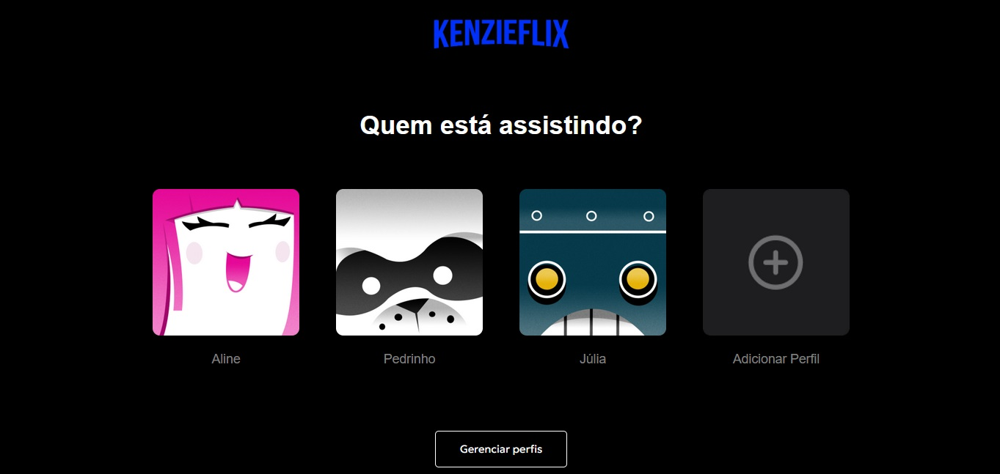

<h1 align="center"> Kenzieflix </h1>

Programa exclusivo, promovido pela Kenzie Academy para ensino de tecnologias WEB.  

  <a href="#-tecnologias">Tecnologias</a>&nbsp;&nbsp;&nbsp;|&nbsp;&nbsp;&nbsp;
  <a href="#-projeto">Projeto</a>&nbsp;&nbsp;&nbsp;|&nbsp;&nbsp;&nbsp;
  <a href="#memo-licença">Licença</a>

  

 

  

## 🚀 Tecnologias

Esse projeto foi desenvolvido com as seguintes tecnologias:

- HTML
- CSS
- Git e Github

## 💻 Projeto

KenzieFlix: sua página de escolha de perfis para uma experiência de entretenimento personalizada.

- [Acesse o projeto finalizado, online](https://kenzie-academy-brasil-developers.github.io/m1-kenzie-flix_Miguellljr/)

## 🔖  Licença

Esse projeto está sob a licença MIT.

---